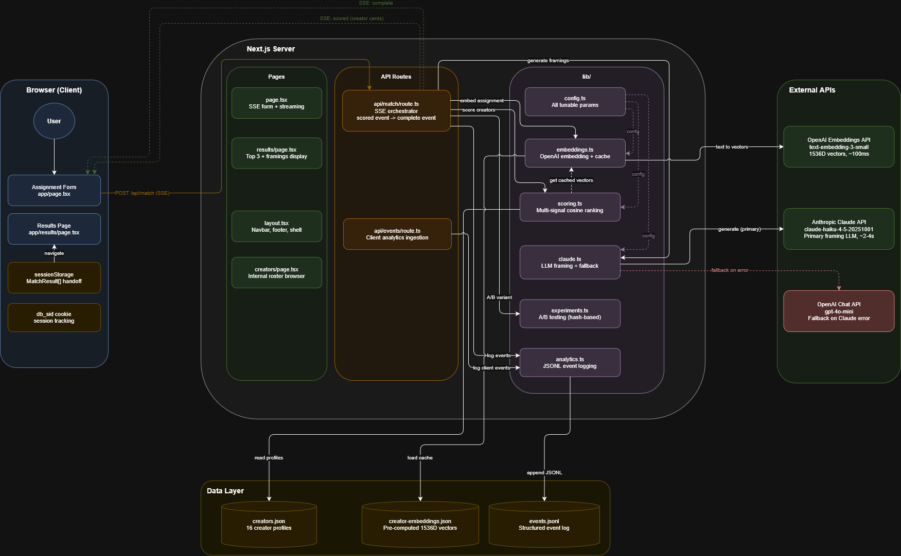

# dl-matching-framing

An internal tool that matches nonprofit campaign briefs to TikTok creators using semantic embeddings, then generates personalized post framings via Claude Haiku.

---

## Architecture



> To regenerate: `npm run export-diagram` (requires draw.io desktop CLI on PATH), or open `architecture.drawio` directly in draw.io or VS Code with the Draw.io extension.

---

## Quick Start

```bash
npm install
```

Create `.env.local`:
```
ANTHROPIC_API_KEY=sk-ant-...
OPENAI_API_KEY=sk-...
POSTHOG_API_KEY=phc_...              # Server-side events — omit to fall back to console.log
POSTHOG_HOST=https://app.posthog.com # Server-side host (default: app.posthog.com)
NEXT_PUBLIC_POSTHOG_KEY=phc_...      # Client-side page views (same value as POSTHOG_API_KEY)
NEXT_PUBLIC_POSTHOG_HOST=https://app.posthog.com  # Client-side host
```

Pre-compute creator embeddings (run once; commit the output):
```bash
npm run generate-embeddings
```

```bash
npm run dev
```

Open [http://localhost:3000](http://localhost:3000).

---

## What AI Is Used For (and Why)

**Two AI calls per request — nothing more.**

| Step | Technology | Why AI |
|------|-----------|--------|
| Ranking creators | OpenAI `text-embedding-3-small` | Semantic similarity catches related concepts keyword search misses — "consumer awareness" ↔ "economic anxiety" share no words but sit close in embedding space |
| Writing framings | Claude Haiku (gpt-4o-mini fallback) | Natural language tailored to each creator's style and audience can't be produced deterministically |

**Where AI is explicitly not used:** routing, session management, A/B variant assignment, input validation, form rendering, analytics logging. These are deterministic problems. Using AI for them adds cost and nondeterminism without adding value.

---

## Matching Approach

The brief and each creator profile are embedded as vectors. Creators are ranked by a weighted combination of five signals:

| Signal | Weight | Active when |
|--------|--------|-------------|
| `semantic` | 60% | Always — full-profile cosine similarity |
| `audience` | 15% | `targetAudience` field is filled |
| `values` | 15% | `values` field is filled |
| `tone` | 5% | `tone` field is filled |
| `engagement` | 5% | Always — heart/follower ratio |

Filling optional fields shifts weight toward those targeted dimensions rather than adding bonus points — scores stay comparable across submissions. All weights are tunable in `lib/config.ts` without touching the algorithm.

Creator embeddings are pre-computed and committed. Runtime cost is one embedding call for the assignment (~100ms, ~$0.00002).

**When no strong match exists.** The system always returns the top 3 by score — it doesn't suppress results below a threshold. If the best available creator scores 38/100, the user still sees them alongside a match explanation that references their actual profile rather than inventing relevance. The score itself and the concrete explanation give the user enough signal to decide whether to proceed or refine the brief. Suppressing results would be worse UX: the user wouldn't know whether the sparse pool or a weak brief was the problem.

---

## UX Decisions

**Speed of first result.** Creator cards appear within ~200ms of submitting, before the LLM has written anything. The user reads real content (name, bio, niches, follower count) while Claude runs in the background.

**Progressive disclosure.** Required fields (topic, takeaway, context) in the main card. Optional fields in a separate card below with a "More detail = more precise matching" hint. A first-time user submits a valid brief without reading documentation.

**Results that explain themselves.** "Why they match" in 1–3 sentences references the creator's actual niche, tone, or audience — not generic praise. "Suggested Post Framing" is a concrete content concept, not vague guidance. The Top Match badge and indigo border nudge without mandating.

**Thoughtful UI states.**

- **Loading** — Two-phase SSE stream: the `scored` event arrives first (~200ms) and renders full creator cards with shimmer skeleton placeholders in the AI text areas. The user is reading real data (follower count, niches, bio) while Claude is still working. When the `complete` event arrives (~2–4s later), skeletons are replaced with text.
- **Error** — If the SSE stream returns an `error` event (API failure, network drop), an inline error message replaces the loading state. No broken or partially-rendered cards are shown.
- **Insufficient brief** — If required fields contain fewer than 3 meaningful words, the LLM call is skipped entirely and a canned "brief too vague" message appears in place of AI text. Matching still runs — scores still show — so the user can see the result of refining their brief without re-running the embedding.

---

## Cost, Latency & Reliability

| Concern | How it's handled |
|---------|-----------------|
| **Cost** | Creator embeddings are pre-computed and committed — no embedding cost per creator, only one call for the assignment brief (~$0.00002). LLM framing costs ~$0.001–0.003 per request at Haiku pricing. Sparse briefs skip the LLM call entirely: zero cost, zero latency. |
| **Latency** | Embedding + scoring finishes in ~150ms. The SSE pattern means the user sees results at 150ms; the 2–4s LLM wait is concurrent with them reading creator cards. Effective perceived latency is ~200ms. |
| **Reliability** | Claude Haiku is primary; gpt-4o-mini is an automatic hard fallback on any Claude failure. Both providers receive the same prompt (`buildPrompt` is the single source of truth). The A/B experiment routes a portion of traffic directly to OpenAI, which keeps the fallback path warm and provides real quality-comparison data. |
| **Hallucination** | Two-layer defense: a deterministic word-count gate in code blocks LLM calls for sparse briefs; the prompt explicitly forbids filling brief gaps with assumptions. The code gate handles the obvious failure mode; the prompt constraint handles edge cases that pass the gate. |

---

## Model and Provider Choices

| Model | Role | Rationale |
|-------|------|-----------|
| `text-embedding-3-small` | Semantic matching | Fast (~100ms), cheap (~$0.02/MTok), 1536D — sufficient for short creator profiles |
| `claude-haiku-4-5-20251001` | Framing generation | $0.25/$1.25 per MTok in/out, 2–4s latency, good structured output quality |
| `gpt-4o-mini` | Automatic fallback | Same price range, different infrastructure — real redundancy, not a retry |

Claude Sonnet and GPT-4o produce marginally better framings at 5–12× the cost and latency. Prompt engineering matters more than raw model capability for this structured generation task.

---

## Framing Prompt

The exact instructions sent to Claude (and the OpenAI fallback) on every request (`lib/claude.ts → buildPrompt`):

```
You are a creative strategist helping a nonprofit match with TikTok creators
for paid content campaigns.

ASSIGNMENT BRIEF:
Topic: [topic]
Key takeaway: [keyTakeaway]
Context: [context]
Target audience: [targetAudience or "Not specified"]
Desired creator values: [values or "Not specified"]
Desired tone: [tone or "Not specified"]

TOP 3 MATCHED CREATORS (ranked by algorithmic score):
--- Creator 1: [nickname] (@[uniqueId]) ---
Bio: ...
Summary: ...
Primary niches: ...
Values: ...
Tone: ...
Match score: 48/100
[... repeated for creators 2 and 3 ...]

YOUR TASK:
For each creator, write two things:

1. matchExplanation (1–3 sentences): Why this specific creator is a strong fit
   for this specific assignment. Reference their actual niche, tone, audience,
   or values — do NOT write generic praise like "they have great engagement."
   Be concrete. Do NOT invent campaign details that aren't explicitly stated
   in the brief.

2. suggestedFraming (2–4 sentences): A concrete, personalized content concept
   this creator could execute. Tailor it to their established style and their
   audience's interests. Respect any constraints stated in the context field.
   Make each creator's framing distinct — do not repeat the same angle across
   all three. Do NOT fill gaps in the brief with assumptions about what the
   campaign might be.

Respond with valid JSON only. No markdown, no code fences, no explanation
outside the JSON:
{
  "creators": [
    { "uniqueId": "exact_unique_id", "matchExplanation": "...", "suggestedFraming": "..." }
  ]
}

IMPORTANT: Return exactly 3 creators. The uniqueId must exactly match the
creator's uniqueId shown above. Return creators in the same order they appear above.
```

Both Claude and OpenAI receive the same prompt — `buildPrompt` is the single source of truth. Adding a provider means adding a call function and a routing branch, not rewriting the prompt.

---

## Guardrails

### Brief quality gate (code-side)

Before any LLM call is made, `generateFramings()` checks that each required field (topic, key takeaway, context) contains at least 3 meaningful words. If not, it returns a canned "brief insufficient" response immediately — no API call, no cost, no invented content.

This is intentionally in code, not in the prompt. The LLM sees rich creator profiles alongside the brief and will use them to construct a plausible campaign even when the brief is empty. Prompting it to self-police that behavior is unreliable. A deterministic pre-flight check is the right tool.

### Prompt constraints

The framing prompt explicitly instructs the model not to invent campaign details, reference only information actually stated in the brief, and make each creator's framing distinct. These are secondary guardrails for edge cases that pass the quality gate but are still sparse.

### Provider-level safety

Both Claude and OpenAI apply content filtering at the API level. The narrow role definition in the system prompt ("creative strategist for nonprofit TikTok campaigns") limits the surface area for off-topic or harmful outputs.

### API key isolation

All LLM calls happen inside Next.js route handlers. API keys never reach the browser. The client only receives the final processed JSON.

### What's not yet in place (production path)

- **Input sanitization** — strip prompt injection patterns (e.g. "ignore previous instructions") from brief fields before they enter the prompt
- **Output moderation** — run generated framings through OpenAI's Moderation API before sending to the client

---

## What's Next (1–2 Weeks)

1. **Stream LLM tokens word-by-word** — framings appear as they're typed; eliminates the shimmer wait entirely
2. **Track creator selection** — log which creator the user acts on, not just which are surfaced; drives empirical weight tuning
3. **Structured output mode** — guaranteed-schema JSON from Claude and OpenAI eliminates the parse-failure → fallback path
4. **Tune dimension weights** — once selection data exists, experiment with weights in `config.matching.dimensionWeights` and measure against click-through
5. **Input sanitization + output moderation** — strip prompt injection patterns, run framings through OpenAI Moderation API before display

---

## Docs

| Document | Audience | What's in it |
|----------|----------|-------------|
| [PLANNING.md](PLANNING.md) | Product / stakeholders | Questions faced, options considered, decisions made, and reasoning — the "why" behind each choice |
| [ENGINEERING.md](ENGINEERING.md) | Engineers | API contracts, module responsibilities, configuration reference, how to add creators, PostHog setup, hardening path |
| [CLAUDE.md](CLAUDE.md) | Claude Code | Dev commands, key files, common tasks, coding rules, where not to use AI |
