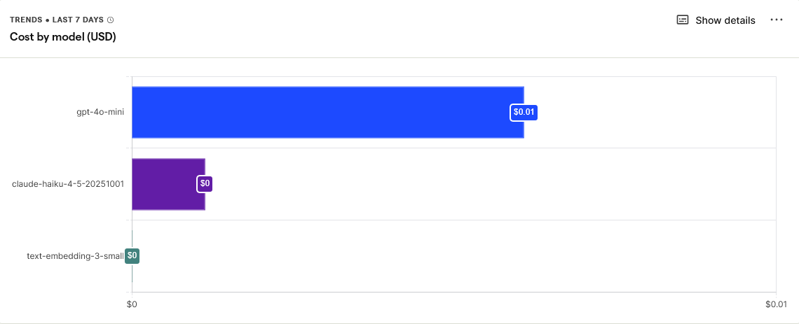
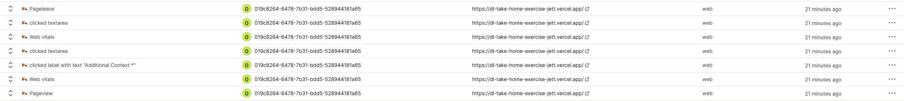
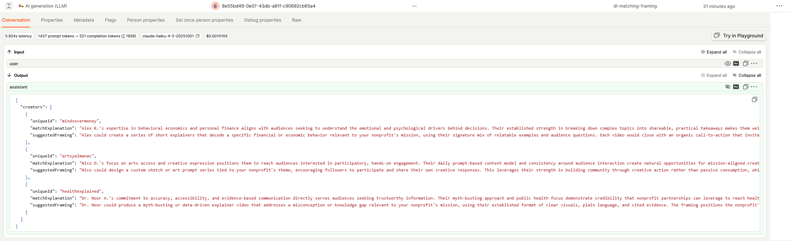

# Creator Matching and Personalized Assignment Framing

A user (a nonprofit or client) enters a content assignment and goals. This product returns:

- The top 3 available matching creators from a provided seed dataset, and
- A personalized suggested framing and idea for a post for each creator, tailored to that creator's profile and the client's assignment

---

## Running Locally

**Prerequisites:** Node.js 18+, an Anthropic API key, and an OpenAI API key.

```bash
npm install
```

Create a `.env.local` file in the project root:

```
ANTHROPIC_API_KEY=sk-ant-...
OPENAI_API_KEY=sk-...
POSTHOG_API_KEY=phc_...         # Optional — omit to fall back to console.log
NEXT_PUBLIC_POSTHOG_KEY=phc_... # Optional — same value as above
```

Pre-compute creator embeddings (run once before starting the server; commit the output file):

```bash
npm run generate-embeddings
```

Start the development server:

```bash
npm run dev
```

Open [http://localhost:3000](http://localhost:3000).

---

## UX Decisions

**Simplicity first.** The form is designed to feel lightweight and unintimidating. Text areas auto-resize as the user types, up to a defined maximum. Placeholder text explains what belongs in each field without requiring documentation. The character counter only appears when a user is approaching the limit, so it never stresses someone who is just getting started. I also reconsidered the field names from the brief spec where slashes introduced ambiguity. "Tone / Style" became "Tone," "Key Takeaway / Message" became "Key Takeaway," and "Creator Values / Niches" became "Creator Values." In each case I chose the framing I felt was clearer and more useful. Content guidelines and background information both fit naturally into the Additional Context field, which keeps the form from feeling like a checklist.

**Complexity on request, not by default.** The matching algorithm produces strong results with just the three required fields of topic, key takeaway, and additional context. Everything beyond that lives in a collapsible "Advanced Matching Settings" panel that is closed by default. Opening it reveals optional context fields (target audience, creator values, tone) that activate additional scoring dimensions, alongside sliders for users who want direct control over how much each signal influences the ranking. The progressive disclosure keeps the form lightweight for first-time users while giving power users a clear path to fine-tune the algorithm to their campaign's specific needs.

**Speed that respects the user's time.** The biggest bottleneck in the flow is LLM generation, 2 to 4 seconds on average. Rather than making the user stare at a spinner for that entire window, creator cards appear within approximately 200ms of submitting the form, as soon as the deterministic scoring step finishes. The user is already reading real, useful information of the creator's name, follower count, niches, and bio while the AI is still writing in the background. The goal is a perceived wait time that would never make someone click away.

**Always communicating state.** The app makes it clear at every moment whether it is loading or done. Creator cards appear immediately with shimmer skeleton placeholders (animated pulsing blocks) in the sections where AI-generated text will go. This communicates both that the app is working and that more information is on the way. When the AI finishes, the skeletons are replaced seamlessly.

**Results that help the user decide.** The top-ranked match is highlighted with a distinct indigo border and a "Top Match" badge with a star. The match explanation references the creator's actual niche, tone, or audience, and I tried to minimize generic praise as much as possible. The suggested framing is a concrete content concept, not vague direction. Together, these give the user enough to act without needing a separate briefing document.

**Brand cohesion.** The application uses a consistent theme throughout: one font (Poppins), a warm cream palette, and a dark navy header and footer, all defined as CSS variables in `app/globals.css` so the whole look can be re-themed from one place. The navbar and footer also include a link back to a landing page and placeholder terms/privacy links, ready to be swapped for a real marketing site.

**Resilience as a user experience decision.** If Claude goes down, the app automatically falls back to OpenAI with no user-facing error. The user never knows a provider switch happened. Perhaps this belongs outside of this section but I think of reliability as part of UX, an app that silently degrades gracefully leads to a better experience than one that surfaces infrastructure problems to the client.

---

## Matching Approach

### What I Considered

When designing the matching system I evaluated three approaches:

**Keyword matching**: score creators by how many words from the assignment overlap with their profile. Fast and transparent, but it completely fails when semantically related concepts share no words. "Consumer awareness" and "economic anxiety" describe the same idea but have zero lexical overlap. A keyword system would miss this entirely.

**LLM ranking**: send the brief and all creator profiles to a model and ask it to rank them. Handles nuance well, but it must happen before the user sees anything, adding 2 to 4 seconds of blank-screen wait before a single result is shown. It is also expensive at scale, non-deterministic (the same brief can produce different rankings on different calls), and requires re-sending all creator profiles with every request.

**Semantic embeddings**: convert both the assignment brief and each creator profile to high-dimensional vectors, then rank creators by cosine similarity. This approach is meaning-aware, fast, cheap, and deterministic.

I chose embeddings. The key insight from my earlier work on a travel advisor LLM is that embeddings can be computed once per creator and stored, meaning the runtime cost of each new request is just a single API call to embed the assignment, not the entire creator database. Ranking then becomes a fast mathematical operation (dot products of normalized vectors), as opposed to another LLM call which is really the only (necessary) bottleneck in the system.

### How Matching Works

The system uses a five-signal weighted scoring pipeline. Each request embeds the assignment brief and computes cosine similarity against pre-stored creator vectors across multiple semantic subspaces:

| Signal | Weight | Active when |
|--------|--------|-------------|
| Semantic | 60% | Always — full-profile similarity |
| Audience | 15% | User fills in Target Audience |
| Values | 15% | User fills in Creator Values |
| Tone | 5% | User fills in Tone |
| Engagement | 5% | Always — heart-to-follower ratio |

The **semantic signal** compares the full assignment against each creator's complete embedded profile. This catches the broad thematic match, for example if the creator generally operates in the space of the assignment.

The **audience, values, and tone signals** are targeted comparisons: the user's stated target audience text is embedded and compared specifically against each creator's audience interest vectors; stated values are compared against creator value and cause vectors; stated tone against their engagement style vectors. These let a nonprofit that cares deeply about, say, economic equity surface creators whose stated values align, even if their content topics are adjacent rather than identical.

The **engagement signal** is purely mathematical: total hearts divided by follower count times five, clamped to 1.0. A creator with hearts equal to five times their follower count scores 1.0. No API call required.

When optional fields are filled, their weight shifts into the total rather than adding bonus points. Scores stay comparable across submissions regardless of how many optional fields are completed. All weights are configurable in `lib/config.ts` without touching the algorithm.

Creator embeddings are pre-computed, stored in `data/creator-embeddings.json`, and committed to the repository. The runtime cost for each user request is one OpenAI embedding call for the assignment brief: roughly $0.00002 and 100ms.

### When No Strong Match Exists

The system always returns the top 3 by score. It does not suppress results below a threshold.

From my testing the system does a great job of bridging the gap best utilizing the data it has about the creators even in cases where the internal scoring metric was low for the best match. My assumption here is that we want to onboard as many clients as we can, and I personally am a believer in individuals beimg multifaceted and able to adapt to aid a cause for the better even if its not in their domain (obviously we try to give creators that are, but I think its always worth a shot for them to get their message out!). In production it would be worth looking into how these cases with low matches actually end up perfoming in terms of views to test my theory, which is something we can absolutely do with my some adjustments to the current integration I set up with PostHog.

### Geographic Assumption

The current implementation assumes the client is a US-based nonprofit, based on the fact that I noticed we currently require the creators to be US Citizens. When a creator's region is listed as EU, UK, or any non-US location, that information is displayed in orange on their card as a flag that there may be regulatory, audience, or campaign fit considerations. The underlying score is not penalized by default, but `lib/config.ts` exposes a `nonUSPenalty` multiplier that can reduce non-US creators' effective scores if geographic targeting becomes a priority.

---

## AI Decisions

### Model Selection

I evaluated four models for the framing generation step:

| Model | Input cost | Latency | Notes |
|-------|-----------|---------|-------|
| Claude Haiku | $0.25 per million tokens | 2 to 4s | Good structured output, strong instruction-following |
| Claude Sonnet | $3.00 per million tokens | 4 to 8s |  12x more expensive than Haiku |
| gpt-4o-mini | $0.15 per million tokens | 2 to 4s | Comparable quality, different infrastructure |
| gpt-4o | $2.50 per million tokens | 5 to 10s | Better, but 10x the cost |

I chose **Claude Haiku as primary with gpt-4o-mini as the automatic fallback.**

For a structured generation task driven by a detailed prompt, I found that prompt engineering was able to make the model return excellent results in any case where I gave it a coherent assignment. The marginal quality improvement from a larger model does not justify a 5 to 12x increase in cost and a meaningful latency hit for users. Haiku produces specific, grounded framings at a price point that makes the product viable at scale.

The fallback uses OpenAI rather than a second Claude attempt because real redundancy means different infrastructure. If Claude's API is experiencing issues, retrying Claude fails the same way. gpt-4o-mini has comparable pricing and speed and runs on entirely separate systems — making it a meaningful safety net rather than a retry loop.

### Switching LLMs

Changing the primary model is a one-line edit in `lib/config.ts`:

```typescript
llm: {
  providers: {
    claude: { model: "claude-haiku-4-5-20251001" }, // change this
    openai: { model: "gpt-4o-mini" }                // or this
  }
}
```

No other file needs to change. Both providers receive the identical prompt from `buildPrompt()` in `lib/claude.ts`, which is the single source of truth. Adding a new LLM provider means writing a `callProvider()` function and a routing branch. The prompt, scoring, and analytics all stay unchanged. This felt important to design carefully given how quickly the LLM landscape is evolving! A model that is cheaper, faster, or more capable will emerge, and the architecture should make adopting it a small change rather than a refactor.

The A/B experiment framework in `lib/experiments.ts` also supports live traffic splitting between providers. For example, routing 80% of sessions to Claude and 20% to OpenAI — so quality comparisons between models can be run on real traffic without a code deploy.

### Cost, Latency, Reliability, and Safety

**Cost.** Creator embeddings are computed once and stored, there is no per-creator embedding cost at runtime. Each user request costs one assignment embedding call (approximately $0.00002) plus one LLM framing call (approximately $0.001 to $0.003 at Haiku pricing). Total cost per request is well under half a cent.

**Latency.** Embedding and scoring finishes in approximately 150ms. The SSE streaming pattern means the user sees their creator cards at that point — they do not wait for the LLM. The 2 to 4 second framing generation runs while they are reading. Effective perceived latency is around 200ms.

**Reliability.** Claude is primary; gpt-4o-mini is the automatic hard fallback on any Claude failure. Both providers use the same prompt. A `provider_fallback` event is logged to PostHog whenever the switch occurs so the fallback rate is visible in dashboards.

**Safety and guardrails.** Both Claude and OpenAI apply content filtering at the API level. Anthropic's engineering team works continuously to prevent the model from producing harmful outputs, which is a real advantage of using their API as opposed to say a model we try to build from scratch. The narrow role definition in the prompt ("creative strategist for nonprofit TikTok campaigns") further limits the surface area for off-topic or harmful responses. If I had more time to polish and adjust I would employ more rigorous attempts to break the API myself however, as well as setting up monitoring for any less than ideal responses through PostHog. Also, API keys are never sent to the browser. All LLM calls happen inside Next.js route handlers on the server.

### The Prompt

Both Claude and gpt-4o-mini receive the same prompt on every request. I chose to give the model significant structural guidance, it receives the full creator profiles, not just names, so it can write framings that reference real evidence from each creator's history. The explicit prohibitions ("do NOT invent campaign details," "do NOT fill gaps with assumptions") are the most important lines in the prompt: without them, the model would confidently constructs plausible-sounding campaigns from creator profile data when the brief is sparse, which looks impressive but is fabricated (as a side note, it still does this in cases where there is truly nonsensical information (say the user inputting "a" for the required fields, but in any case where the user is giving it an honest shot, it performs quite well as far as I could test!).

```
You are a creative strategist helping a nonprofit match with TikTok creators
for paid content campaigns.

ASSIGNMENT BRIEF:
Topic: [topic]
Key takeaway: [keyTakeaway]
Context: [context]
Target audience: [targetAudience or "Not specified"]
Desired creator values: [values or "Not specified"]
Desired tone: [tone or "Not specified"]

TOP 3 MATCHED CREATORS (ranked by algorithmic score):
--- Creator 1: [nickname] (@[uniqueId]) ---
Bio: ...
Summary: ...
Primary niches: ...
Values: ...
Tone: ...
Match score: 48/100
[... repeated for creators 2 and 3 ...]

YOUR TASK:
For each creator, write two things:

1. matchExplanation (1-3 sentences): Why this specific creator is a strong fit
   for this specific assignment. Reference their actual niche, tone, audience,
   or values -- do NOT write generic praise like "they have great engagement."
   Be concrete. Do NOT invent campaign details that aren't explicitly stated
   in the brief.

2. suggestedFraming (2-4 sentences): A concrete, personalized content concept
   this creator could execute. Tailor it to their established style and their
   audience's interests. Respect any constraints stated in the context field.
   Make each creator's framing distinct -- do not repeat the same angle across
   all three. Do NOT fill gaps in the brief with assumptions about what the
   campaign might be.

Respond with valid JSON only. No markdown, no code fences, no explanation
outside the JSON.

IMPORTANT: Return exactly 3 creators. The uniqueId must exactly match the
creator's uniqueId shown above. Return creators in the same order they appear above.
```

The single-batch approach, meaning one call to the API for all three creators is cheaper (the assignment context is sent once, not three times), faster (one network round-trip), and produces more distinct framings because the model sees all three creators simultaneously and naturally avoids repeating the same angle.

---

## Data Collection

I use [PostHog](https://posthog.com) for analytics. PostHog is free up to 1 million events per month, at 5 to 7 events per user request, that covers roughly 150,000 matches per month before any cost kicks in. Beyond the free tier, pricing is low enough that analytics cost is essentially never the binding constraint.

Each request fires two PostHog LLM Observability events (`$ai_generation`), one for the embedding call and one for the framing call, linked by a shared trace ID so they appear together in a single trace view. This gives visibility into per-request total cost, latency by provider, input and output token counts, and fallback rate, all without custom queries.

Other tracked events:

| Event | When |
|-------|------|
| `assignment_submitted` | Form submitted |
| `match_completed` | Scoring and framing finished |
| `provider_fallback` | Claude failed, OpenAI took over |
| `ui_interaction` | Client-side button clicks and actions |
| `$pageview` | Each page navigation |

We can check on the cost breakdown across models used such as Claude Haiku, GPT-4o Mini, and OpenAI Embeddingsl directly in PostHog's LLM Observability dashboard:



PostHog also captures granular UI interactions alongside pageviews, so it is possible to see exactly where users engage in the form, down to which specific field they clicked:



Each LLM call is stored with its full input and output, token counts, latency, and estimated cost. The input text is collapsed in the view below due to its size, but it is fully accessible for debugging or prompt auditing:



The A/B experiment framework is built to work alongside PostHog: every analytics event includes the user's current variant assignments, so any Insights query can be filtered or broken down by experiment variant. The infrastructure is in place to run experiments and measure their effect on any tracked metric like latency, fallback rate, or any future engagement signal we add.

---

## Scope Choices

### Tech Stack

| Layer | Choice | Alternatives considered |
|-------|--------|------------------------|
| Framework | Next.js 16 (App Router) | Express + React, Remix, SvelteKit |
| UI | React 19 + Tailwind CSS v4 | Styled Components, CSS Modules, plain CSS |
| Language | TypeScript (strict) | JavaScript |
| Primary LLM | Claude Haiku | GPT-4o-mini only, Gemini Flash |
| Embeddings | OpenAI text-embedding-3-small | Cohere Embed, local models (e.g. all-MiniLM) |
| Linter | Biome | ESLint + Prettier |
| Analytics | PostHog | Mixpanel, Amplitude, custom logging |
| Deployment | Vercel | Railway, Render, AWS Amplify |

### Architecture: Modular Monolith

For a project of this scope, a modular monolith is the right call. The entire app fits in a single Next.js repo: the API route handlers live alongside the React components, the shared types are imported by both, and deployment is a single `git push`. There is no inter-service network latency, no distributed tracing overhead, and no service discovery, instead I just made sure to upkeep clean module boundaries within the one process.

The module structure is already set up as if these were independent services. `lib/scoring.ts` knows nothing about `lib/claude.ts`. `lib/analytics.ts` has no import from `lib/embeddings.ts`. If the system needed to grow into microservices, each module maps directly to a service, as the interfaces are already the right shape. For a prototype at this scope, this was a reasonable choice since the structure gives all the organizational benefits of microservices without the operational overhead.

### On TypeScript

TypeScript was a natural fit for this project. The LLM response pipeline involves several data transformations such as: raw JSON from the API, a parsed `FramingResponse`, a `ScoredCreator` array, and a final `MatchResult`. TypeScript catches shape mismatches at compile time rather than letting them surface as runtime bugs in production. The strict mode setting means `undefined` can never sneak through unexpectedly. The shared `types/index.ts` file means the client and server components are guaranteed to agree on the shape of every data structure. The most fragile piece of this project is parsing the non-deterministic LLM JSON output, so that compile-time confidence is genuinely valuable.

---

## Changes I Would Make for Production

**Move to a cloud-native microservices architecture.** The modular monolith is appropriate for a prototype but would become a scaling bottleneck in production. I would separate the matching service (embedding + scoring) from the framing service (LLM generation) and from the frontend. Running them on AWS ECS Fargate or similar gives independent scaling. If framing load spikes, only framing instances scale; if the matching service is fast and cheap, it stays at a lower replica count. I would move off Vercel for the API tier specifically, since Vercel's serverless functions have cold start latency and execution time limits that matter for SSE connections. The frontend could stay on Vercel but personally I would rather move to CloudFront since the API tier would already be on AWS and we wouldnt have to deal with cross-provider latency.

**Build out the security layer properly.** Right now there is no authentication, no rate limiting, and no input sanitization. In production I would add authentication (Clerk or Auth0 with RBAC so only authorized clients can submit), per-session and per-IP rate limiting via Upstash Redis, and input sanitization that strips prompt injection patterns (things like "ignore previous instructions") from brief fields before they enter the prompt.

**Invest more in LLM guardrails.** Provider-level content filtering is a good baseline but a determined bad actor could still coerce the model into producing content that damages the brand behind the deployment. In production I would add a moderation pass such as running generated framings through OpenAI's Moderation API before sending them to the client, and consider a secondary review prompt for any framing that scores above a sensitivity threshold. It may also be worth exploring Anthropic's Constitutional AI features for additional constraints at the generation level (perhaps taking the best aspects of both providers in terms of guardrails, regardless of which is being utilized).

**Deepen the PostHog integration.** I would add event capture for which creator a user ultimately selects or copies a framing from — right now we know which creators are surfaced but not which one the user acts on. That outcome signal is what makes the rest of the analytics actionable: you can start running real experiments on dimension weights and measure whether weight changes lead to higher selection rates for the top match. I would also set up PostHog's session replay and use it to watch how real users navigate the results page. Funnel analysis from form submission to creator selection would tell us whether the progressive loading approach actually reduces abandonment.

**Take GDPR seriously.** The creator dataset includes profiles from the EU and UK. Before expanding to serve EU nonprofits or accepting EU creator data, I would deeply review GDPR obligations specifically around consent for data storage, the right to erasure, and data residency requirements. I would also confirm that the PostHog configuration routes EU user data to an EU-hosted PostHog instance rather than the US endpoint.

**Align with the deployment's legal documents.** Whoever deploys this should keep the app's data collection and processing in sync with their actual privacy policy and terms of service, and add the current privacy policy URL to `CLAUDE.md` so any future AI-assisted development has context about what commitments have been made to users.

---

## A Note on Creator Profile Images

The `data/creators.json` file includes avatar URLs that are example.com placeholder links generated by ChatGPT so they return 404s when fetched. I chose not to modify the creators.json file to preserve the integrity of the assignment data as provided. Instead, I treated it as an opportunity to demonstrate graceful error handling: the app detects placeholder URLs before making any network request, and displays the creator's initials in a styled avatar circle instead. This is the same pattern a production app would use for any user whose profile image fails to load.

---

## What I Would Do Next (1 to 2 More Weeks)

**Address the sparse brief problem more robustly.** The AI handles a true lack of context poorly. Despite my best prompt engineering, when given minimal input it hallucinates a plausible-sounding assignment based on the creator profiles — it sees rich creator data and uses it to infer what the campaign probably is. I had a naive word-count check in place briefly, but removed it: it was not worth the tradeoff, because a bad actor could trivially bypass it with nonsense words ("hello goodbye why how"), and it penalized real users whose legitimate briefs happened to be terse. A potential solution I was thinking of is an LLM review step that evaluates whether the input is coherent and actionable before proceeding to matching. The tradeoff is that this adds latency for every user to prevent a scenario that affects very few — I am not convinced that is the right call, and I would want to discuss it with the team before implementing it.

**Clean up the mobile experience.** The app was designed assuming desktop use, and while I have made some recent improvements to mobile layout, there is more to do — particularly around the results page and how creator cards stack on narrow screens. Additionally, the weights are hard to click and drag on some set-ups, but I figured this may fall into the overpolishing category for this assingment!

**Invest more in prompt engineering.** The current prompt produces good results but I have not systematically tested edge cases like campaigns with unusual constraints, very short briefs that pass any quality gate, or assignments that span multiple topics. I would spend time generating a test set of representative assignments and evaluating framing quality across it.

**Run real A/B experiments on scoring weights.** The current weights (semantic 60%, audience 15%, values 15%, tone 5%, engagement 5%) are informed priors, not empirically validated. Once outcome tracking (which creator gets selected) is in place, I would run experiments in `lib/experiments.ts` that vary these weights and measure whether different distributions lead to higher selection rates for the top match.

**Discuss my decisions with the team.** There are several UI choices I made that I have genuine uncertainty about. Should the submit button always be visible on screen so users never wonder if they need to scroll down? Does the Advanced Matching Settings panel need to be more prominently signposted, or is collapsed-by-default the right default for this as to not overwhelm users and move them forward without stress? These are the kinds of decisions that benefit enormously from real user feedback, and I would want to get eyes on the app quickly rather than over-engineer them in isolation.

---

## Project Documentation

Three supporting documents are included in this repository, each written for a different audience:

- [PLANNING.md](PLANNING.md) — The "why" document: the product questions faced, the options considered for each, and the reasoning behind each choice.

- [ENGINEERING.md](ENGINEERING.md) — A PRD-style spec for engineers extending this codebase. Covers API contracts, module responsibilities, configuration reference, PostHog observability setup, and the hardening path to production.

- [CLAUDE.md](CLAUDE.md) — Written for Claude Code. Contains dev commands, key files, common tasks, coding rules, and an explicit list of where not to use AI in this codebase. This file shapes how the assistant thinks about contributions to the project.
